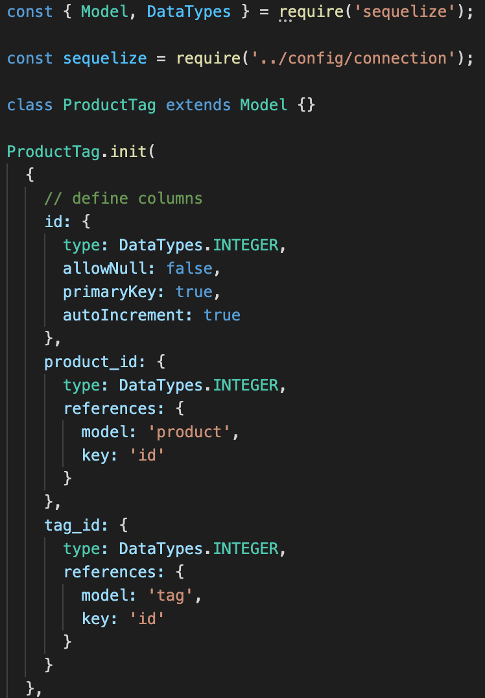
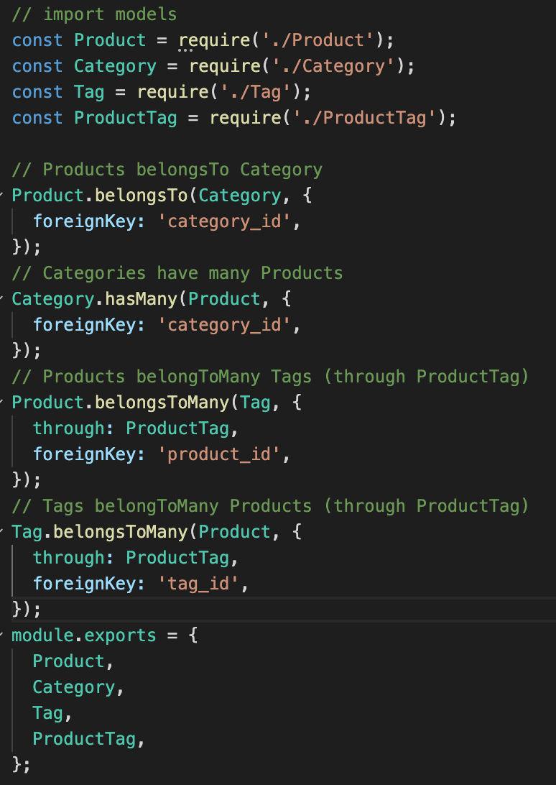
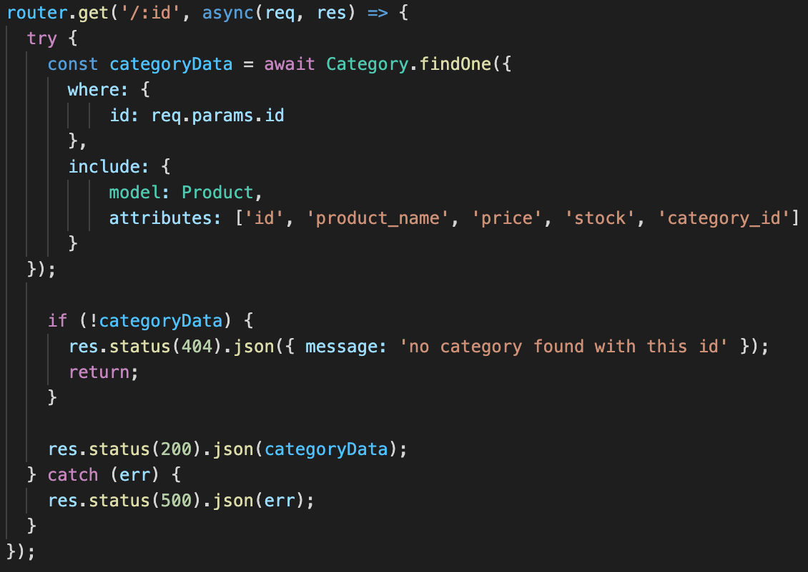
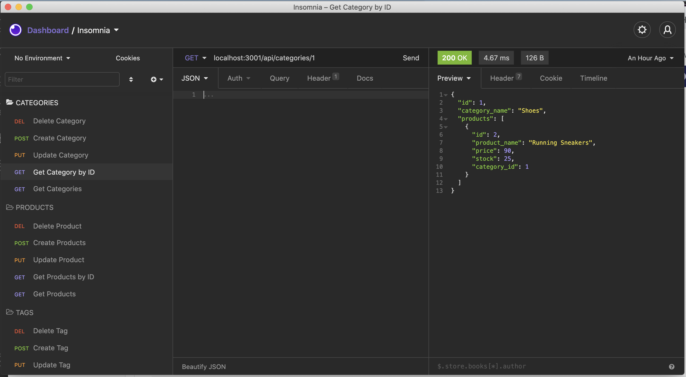

# E-commerce Backend
[](https://opensource.org/licenses/MIT)
## Table of contents
1. [Description](#description)
2. [Installation](#installation)
3. [Usage](#usage)
4. [Contributing](#contributing)
5. [License](#license)
6. [Screenshot](#screenshot)
7. [Questions](#questions)
    
<a name="descriptipn"></a>
## Description
For this project I had to build on supplied code and create a working backend to access the database. I had to create models for the different tables and had to create routes for GET, PUT, POST, DELETE requests. This was a fairly easy assignment because most of the code was already supplied, all I had to do was set up the columns for the models and referenced them to the correct foreign keys. 
The associations were already supplied as well, I just had to make sure that the foreign keys referenced the right table . Honestly the hardest part about this project was making sure the routes were going to the right places
    
<a name="installation"></a>
## Installation
Install all the necessary dependencies do an ```npm install express sequelize mysql2 dotenv``` Make sure you have a .env file with your user and password credentials. Seed the database by typing in "npm run seed" and make sure you open up the schema in mysql workbench and start the connection. 
    
<a name="usage"></a>
## Usage
In Insomnia, once you've connected to the server by running ```node server.js``` in the command line, you can start sending GET/PUT/POST/DELETE requests and the database should show or update with the requests you've made
    
<a name="contributing"></a>
## Contributing
My project is open source, so feel free to make it your own
    
<a name="license"></a>
## License
[](https://opensource.org/licenses/MIT)
<a name="screenshot"></a>
## Screenshot

    
<a name="questions"></a>
## Questions
Feel free to check out my [GitHub](www.github.com/pattymcpat) repository. Also feel free to send me an email at <patrickly72@gmail.com> if you have any questions